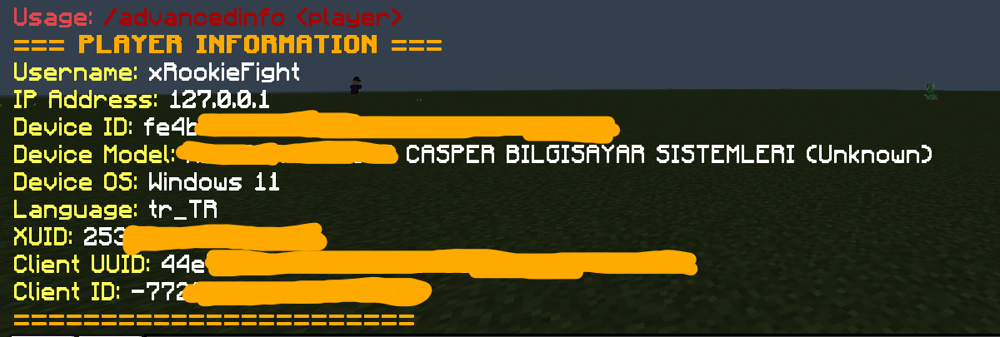

# AdvancedInfo
Advanced player information plugin for PowerNukkitX written with Kotlin.

---

---

## Getting Started

### Installation
1. Download the latest release from [AdvancedInfo](https://github.com/xRookieFight/AdvancedInfo/releases).
2. Place the JAR file into the `plugins` folder of your PowerNukkitX server.
3. Start or reload your server.

## Commands
| Command                  | Description                              | Permission           | Alias         |
|--------------------------|------------------------------------------|----------------------|---------------|
| `/advancedinfo <player>` | Shows online player advanced information | advancedinfo.command | `/playerinfo` |

## License
[LICENSE](./LICENSE)
